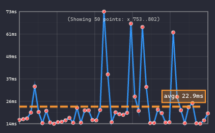
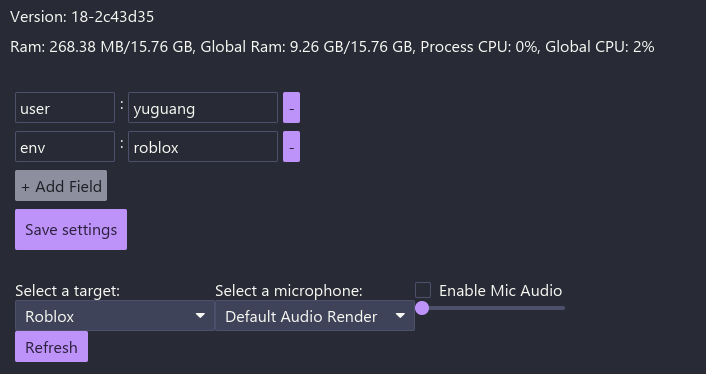
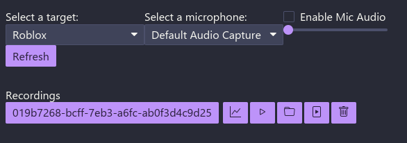

# Open Pixel2Play (P2P)

**Open Pixel2Play (P2P)** is an open foundation model trained to play video games in real time. The model takes **visual input (images) and text instructions** and outputs **keyboard and mouse actions**, enabling direct interaction with real game environments. This is the official repo for paper [Scaling Behavior Cloning Improves Causal Reasoning: An Open Model for Real-Time Video Game Playing](https://arxiv.org/abs/2601.04575).

P2P is trained on **8,000+ hours of human-annotated gameplay videos**. We open-sourced our **full training dataset** on [HuggingFace](https://huggingface.co/datasets/elefantai/p2p-full-data). In the meantime, a [toy sample dataset](https://huggingface.co/datasets/guaguaa/p2p-toy-examples) is available for inspection too.

Our smallest model (**150M parameters**) can be trained on **8× H100 GPUs in ~70 hours**. The largest model (**1.2B parameters**) is trained on **8× H100 GPUs for ~140 hours**

This repository contains:

- The full **training pipeline** for P2P models
- **Inference code** for running trained models
- Integration with [**Recap**](https://github.com/elefant-ai/recap) for real-time interaction with commercial games on Windows

---

## Installation
```bash
git clone https://github.com/open-p2p
cd open-p2p
```

---

## Training and Offline Inference (Linux)

### Prerequisites
```bash
# Install uv package manager
curl -LsSf https://astral.sh/uv/install.sh | sh

# System dependencies
sudo apt update
sudo apt install build-essential git nvtop htop

# FFmpeg 7
sudo add-apt-repository ppa:ubuntuhandbook1/ffmpeg7
sudo apt install ffmpeg
sudo apt install -y libavcodec-dev libavformat-dev libavutil-dev libswscale-dev libavdevice-dev libavfilter-dev

# Clang
sudo apt install -y clang libclang-dev

# Rust
curl --proto '=https' --tlsv1.2 -sSf https://sh.rustup.rs | sh

# Socat (for inference server communication)
sudo apt install socat

# increase the maximum number of open file descriptors
ulimit -n 65535
```

### Download Model Checkpoints
```bash
uv run python scripts/download_checkpoints.py <150M|300M|600M|1200M>
```

### Download Sample Dataset

There are bunch of args you can set for downloading toy dataset/part of the dataset or the output folder.

To download the toy dataset you can run
```bash
uv run python scripts/download_data.py --toy
```

To download the full dataset you can run
```bash
uv run python scripts/download_data.py
```

To download specific batches of the full dataset, use the `--start` and `--end` arguments to specify a range (inclusive):
```bash
uv run python scripts/download_data.py --start 1 --end 5
```

You can also specify a custom output directory with `--output`:
```bash
uv run python scripts/download_data.py --output my_dataset
```

### Training

All dependencies are handled by `uv`.

The full training jobs were completed with 8× H100 GPUs, but the configs should also work with a single H100 or A100 GPU.

To reproduce the models from the paper, use one of the provided configs:

- `config/policy_model/150M.yaml`
- `config/policy_model/300M.yaml`
- `config/policy_model/600M.yaml`
- `config/policy_model/1200M.yaml`

> **Note:** You may need to adjust dataloader-related parameters according to your environment for memory-optimized runs.
```bash
uv run elefant/policy_model/train.py --config config/policy_model/150M.yaml
```

### Validation

Training and validation are deliberately separated for stability. You *can* merge them by lowering `validation_step_interval` in the config, but this may cause instability or crashes.

To run validation on all checkpoints in a directory:
```bash
uv run elefant/policy_model/validation.py --checkpoint_dir <PATH_TO_CHECKPOINT_DIR>
```

Validation results (perplexity) are reported to **Weights & Biases**.

### Inference

> **Note:** Inference can run on Linux without a display, but real-time game interaction requires a Windows machine with Recap.

First, log in to Hugging Face (required for Gemma tokenizer authentication):
```bash
uv run huggingface-cli login
```

To validate inference with a downloaded checkpoint:
```bash
uv run elefant/policy_model/inference.py \
  --config checkpoints/150M/model_config.yaml \
  --checkpoint_path checkpoints/150M/checkpoint-step=00500000.ckpt
```

To verify the code works without downloading weights:
```bash
uv run elefant/policy_model/inference.py \
  --config config/policy_model/150M.yaml \
  --use_random_weights
```

---

## Real-Time Game Inference (Windows)

> **Note:** Game environments are not provided.

### Tested Games

| Platform | Games | Settings |
|----------|-------|----------|
| Roblox | **Rivals**, **Hypershot**, **Be a Shark**, etc. | Camera sensitivity: 0.52 |
| Steam | **DOOM** | Smoothing: 2×, Look sensitivity: 22%, Move sensitivity: 22% |
| Steam | **Quake** | Mouse sensitivity: 3.5, Smoothing: disabled |

### Tested Hardware

- Windows 11 with 2 GPUs
  - RTX 5090 (model inference)
  - RTX 5080 (game rendering)

Technically any hardware that can achieve end-to-end inference latency of **< 50 ms** should be sufficient. A detailed latency breakdown is provided by Recap after each inference session:


### Prerequisites

#### 1. Install NVIDIA GPU Driver

Ensure your GPU drivers are up to date.

#### 2. Install Recap

Follow the instructions at [**Recap**](https://github.com/elefant-ai/recap).

#### 3. Install WSL with Ubuntu 24.04
```bash
wsl --install -d Ubuntu-24.04
```

Reboot if prompted.

#### 4. Increase WSL Memory Limit (Recommended)

Create or edit the file `C:\Users\<username>\.wslconfig`:
```ini
[wsl2]
memory=52GB
```

Set this to a large fraction of your system RAM. Restart WSL (or reboot) for changes to take effect.

#### 5. Install Core Dependencies (Inside WSL)

Clone the repo and follow the [Prerequisites](#prerequisites) section above.

### Getting Started

#### Step 1: Start the Inference Server (WSL)

Ensure `model_config.yaml` and the checkpoint are downloaded from Hugging Face.

**Without Text Input (Default)**

This runs the model without textual instructions. The majority of experiments in our paper use this setting.
```bash
uv run elefant/policy_model/inference.py \
  --config checkpoints/150M/model_config.yaml \
  --checkpoint_path checkpoints/150M/checkpoint-step=00500000.ckpt
```

**With Text Input**

This runs the model with text instructions enabled.
```bash
uv run elefant/policy_model/inference.py \
  --config checkpoints/150M/model_config.yaml \
  --checkpoint_path checkpoints/150M/checkpoint-step=00500000.ckpt \
  --input_text
```

> **Note:** Due to compilation constraints, text input mode must be chosen at launch and cannot be toggled at runtime.

The inference server listens on `/tmp/uds.recap`, which is automatically detected by Recap.

#### Step 2: Start Recap (Windows Command Prompt)

1. Navigate to the Recap repo and run:
```bash
   just trace
```
2. Fill in the metadata fields, feel free to remove the box (click on `-` icon) if you don't need them
3. Select the window to capture (e.g., Roblox)



#### Step 3: Control the Session

| Action | Key |
|--------|-----|
| Start capturing with inference | `Shift` + `]` (you'll hear a beep) |
| Interrupt model control | Move mouse or press any key |
| Resume model control | `[` |
| Stop session | `Shift` + `]` |

After stopping, a folder will open containing:

- An `.mp4` gameplay recording
- An `annotation.proto` file with recorded keyboard and mouse actions



> **How it works:** Recap captures screenshots from the selected window, sends frames to the inference server, receives predicted actions, and executes keyboard/mouse inputs in real time.

---

## Paper & Citation
If you use the data or model in your research, please cite our paper:
```bibtex
@misc{yue2026scaling,
      title={Scaling Behavior Cloning Improves Causal Reasoning: An Open Model for Real-Time Video Game Playing}, 
      author={Yuguang Yue and Irakli Salia and Samuel Hunt and Chris Green and Wenzhe Shi and Jonathan J. Hunt},
      year={2026},
      eprint={2601.04575},
      archivePrefix={arXiv},
      primaryClass={cs.LG}
}
